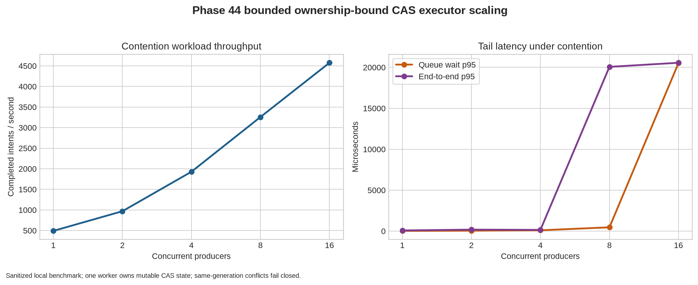

# Phase 44 ownership-bound CAS executor performance report

## Executive summary

Phase 43’s published benchmark was a serial 32-commit run and reported approximately 774,814 microseconds end to end, or roughly 41 commits per second for that local filesystem/signature/snapshot path. It did not measure queue wait, p50/p95/p99 latency, producer contention, or backpressure. Phase 44 adds a bounded worker-owned executor and a sanitized contention benchmark at 1, 2, 4, 8, and 16 concurrent producers.

The Phase 44 workload intentionally submits same-generation intents. Exactly one intent can commit the generation transition; all other intents must fail closed as stale/conflicting work. Therefore, the throughput values below measure **intent processing and rejection throughput under contention**, not successful durable-write throughput. The executor scales accepted-intent processing from approximately 491 to 4,575 intents per second as producers increase from 1 to 16, while p95 queue wait and end-to-end latency become the limiting factors at 8 and 16 producers. The worker’s p95 service time remains comparatively stable, showing that queueing and the single slow filesystem-backed commit dominate tail behavior.

## Measured results

| Producers | Jobs | Successful commits | Fail-closed conflicts | Throughput (intents/s) | Queue wait p95 (µs) | Service p95 (µs) | End-to-end p95 (µs) |
|---:|---:|---:|---:|---:|---:|---:|---:|
| 1 | 16 | 1 | 15 | 490.9 | 23 | 53 | 77 |
| 2 | 32 | 1 | 31 | 968.4 | 46 | 88 | 177 |
| 4 | 64 | 1 | 63 | 1,927.5 | 98 | 48 | 145 |
| 8 | 128 | 1 | 127 | 3,257.3 | 459 | 75 | 20,064 |
| 16 | 256 | 1 | 255 | 4,575.2 | 20,519 | 72 | 20,560 |

All five levels accepted every submitted intent because the queue was sized above the workload. The integration suite separately verifies deterministic `QueueFull` behavior with a one-slot queue. The benchmark recorded zero queue-full rejections, 4,096-sample capacity was not approached, and every level preserved the one-success/remaining-conflicts invariant.

## Performance interpretation

The executor improves aggregate intent-processing throughput by approximately **9.3×** from one to sixteen producers. This is not evidence of ninefold durable-write scaling: the same-generation workload has one valid commit and many deliberately rejected conflicts. The increase mainly reflects more concurrent producers keeping the worker occupied and amortizing thread and fixture setup over larger batches.

The service p95 remains between approximately 48 and 88 microseconds across the tested levels, but the service maximum is approximately 20–21 milliseconds at each level. That split indicates a rare slow path, consistent with the filesystem-backed ownership/CAS persistence work, rather than a broad increase in per-intent verification cost. The end-to-end p95 exposes this outlier once enough producers queue behind it: it rises from 145 microseconds at four producers to approximately 20.1 milliseconds at eight and 20.6 milliseconds at sixteen.

Queue wait p95 rises from 23 microseconds at one producer to 20,519 microseconds at sixteen producers. The sharp transition between four and eight producers is the primary saturation signal. The single worker preserves the required mutation boundary, but it also serializes every accepted intent behind the slowest ownership-bound commit. This is the correct safety behavior for Phase 44, and it establishes a measurable target for the next phase rather than hiding the cost behind unbounded threads or an unsafe shared mutable coordinator.

## Safety and compliance interpretation

| Control | Result |
|---|---|
| Mutable coordinator ownership | One worker owns the Phase 43 coordinator; producers submit owned intents only. |
| Queue admission | Fixed-capacity synchronous queue with non-blocking `try_send`; full queues return typed `QueueFull`. |
| FIFO behavior | Prebuilt valid sequential intents advance generations in order. |
| Conflict behavior | Concurrent same-generation intents produce one commit and fail closed for the remainder. |
| Shutdown | Accepted work drains; new work after close returns typed `Shutdown`. |
| Metrics retention | Latency samples are capped at 4,096 entries and expose sanitized p50/p95/max values. |
| Evidence hygiene | No keys, signatures, canonical payloads, raw fencing tokens, or cluster mutation are recorded. |
| Compliance | The complete audit reports **185/185 gates passed**. |

## Recommended Phase 45

The next highest-leverage phase is a **pre-admission verification pipeline** that performs bounded, parallel, read-only validation of signatures, request hashes, acknowledgement freshness, and distinct-replica quorum evidence before the single mutation worker. The mutation worker would still re-check the exact ownership permit, current record hash, current CAS generation, and lock-held state immediately before persistence. This preserves fail-closed semantics while moving CPU-heavy verification out of the serialized persistence path.

Phase 45 should compare three workloads separately: valid sequential commits, same-generation conflict storms, and mixed valid/conflicting traffic. It should measure verification-pool queue wait, mutation-lock wait, service time, end-to-end p50/p95/p99, throughput of successful commits, conflict rate, backpressure, and rollback behavior. No optimization should claim production durability until it is exercised with real cross-process ownership, managed-volume latency, replica-domain faults, and process-fencing adapters.

## References

[1]: `../benchmarks/phase44_ownership_bound_cas_executor_metrics.json` — sanitized Phase 44 high-concurrency benchmark artifact.
[2]: `../benchmarks/phase44_executor_scaling.png` — deterministic throughput and tail-latency chart generated from [1].
[3]: `../src/ownership_bound_cas_executor.rs` — bounded worker-owned executor implementation.
[4]: `../tests/phase44_ownership_bound_cas_executor_integration.rs` — Phase 44 executor integration tests.
[5]: `../docs/PHASE44_OWNERSHIP_BOUND_CAS_EXECUTOR_PLAN.md` — Phase 44 design and acceptance criteria.
[6]: `../benchmarks/security_compliance_audit.json` — published 177-gate predecessor audit artifact.
