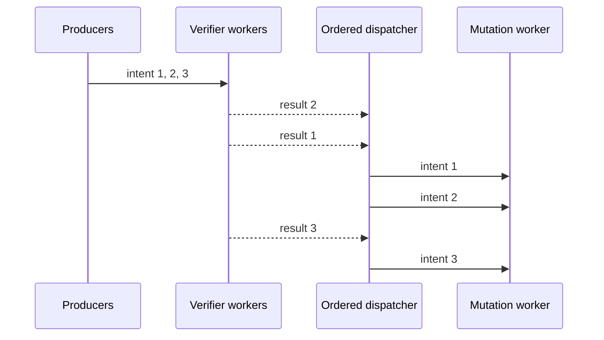

# Phase 45 architecture: bounded parallel pre-admission verification

## Slide 1 — Title

**Phase 45: Bounded Parallel Pre-Admission Verification**

Subtitle: Moving read-only cryptographic checks off the mutation worker without weakening ownership-epoch fencing.

Footer: un1c0 local-first agentic language system | Verified through Phase 45 | Phase 46 optimization in progress

Visual direction: dark navy background, thin electric-blue pipeline line, lock icon motif, and a small “193 gates” badge.

## Slide 2 — Why Phase 45 exists

**Observed bottleneck under contention**

Phase 45’s 16-producer benchmark measured approximately 45.8 ms verification-service p95, 33.5 ms verification-wait p95, 77.3 ms end-to-end p95, and 0.187 ms mutation-service p95.

Key message: the authoritative mutation path is short; signature verification, canonicalization, and ordered-dispatch backlog dominate the tail.

Visual: use `../benchmarks/phase45_latency_breakdown.png` as the primary chart. Highlight the 16-producer point and annotate that mutation p95 stays sub-millisecond.

## Slide 3 — System boundary

**One authority, one ordered mutation path**

Callout: pre-admission is an optimization; Phase 43 lock-held revalidation remains the security authority.

## Slide 4 — What runs in parallel

**Read-only checks that can safely leave the worker**

The verifier checks request shape, resource binding, writer signature, request content hash, proposed-hash equality, replica acknowledgement shape, replica signatures, acknowledgement event hashes, request/ack binding, freshness, duplicate conflicts, and distinct-replica quorum.

The context contains cloned identifiers, quorum policy, and pinned public-key registries. It cannot mutate ownership records, CAS state, nonce ledgers, snapshots, or locks.

Visual: two-column “parallel-safe” versus “never parallelized” comparison.

## Slide 5 — Ordered dispatch prevents reordering

**Parallel completion; serial state transition**

Each accepted submission receives a contiguous intent ID only after bounded queue admission. Verifier workers may finish out of order. A bounded ordered dispatcher buffers results in a `BTreeMap` and forwards only the next expected ID to the mutation worker.

Callout: queue-full rejection does not consume an intent ID, preventing a permanent dispatcher gap.

## Slide 6 — Security invariants

**What Phase 45 refuses to weaken**

| Invariant | Enforcement |
|---|---|
| Ownership epoch | Phase 43 permit and epoch revalidated under the live ownership lock |
| Record binding | Owner, process, epoch, and record hash must match exactly |
| CAS safety | Current generation and content hash revalidated before persistence |
| Quorum safety | Distinct signed replica acknowledgements required before mutation |
| Freshness | Acknowledgement observed tick and TTL checked on every pre-admission call |
| Failure behavior | Forged evidence fails before mutation; stale/conflicting work fails closed at mutation |

Visual direction: red “authority boundary” line around the mutation worker and lock.

## Slide 7 — Typed failure paths

**Fail closed, never guess**

Show five typed outcomes as a horizontal state strip: `VerificationQueueFull`, `PreAdmission`, `VerificationEvidenceMismatch`, `Mutation`, and `Shutdown`.

Explain that channel disconnect, worker termination, malformed signatures, forged hashes, stale ownership permits, quorum loss, and persistence failures are never converted into success. This is the execution-kernel rule that keeps model/tool output below the authority boundary.

## Slide 8 — Sanitized stress evidence

**Safety holds under 1–16 producers**

| Producers | Jobs | Successful commits | Fail-closed conflicts | Throughput (intents/s) |
|---:|---:|---:|---:|---:|
| 1 | 16 | 1 | 15 | 40.7 |
| 2 | 32 | 1 | 31 | 79.9 |
| 4 | 64 | 1 | 63 | 159.7 |
| 8 | 128 | 1 | 127 | 243.1 |
| 16 | 256 | 1 | 255 | 264.0 |

Callout: this is conflict-intent throughput, not successful durable-write throughput. The invariant is exactly one same-generation commit.

## Slide 9 — Phase 45 validation evidence

**193/193 gates passed**

Include badges for: Phase 41–45 regression suites, bounded worker and queue tests, forged-evidence isolation, FIFO/ordered dispatch, stale/conflict revalidation, all-target Rust tests, Helm fail-closed validation, isolated Podman Compose mTLS smoke, and sanitized evidence.

Security note: no secret material recorded; no cluster mutation performed.

External references: Rust bounded FIFO channels at [Rust mpsc docs](https://doc.rust-lang.org/std/sync/mpsc/index.html); ownership/message passing at [The Rust Programming Language](https://doc.rust-lang.org/book/ch16-02-message-passing.html); Ed25519 verification at [RFC 8032](https://datatracker.ietf.org/doc/html/rfc8032).

## Slide 10 — Phase 46: the next optimization boundary

**Adaptive admission and verification-cost reduction**

Phase 46 adds a bounded in-flight limiter, additive recovery, multiplicative decrease on verifier pressure, parsed pinned-key reuse, and context-fingerprint-bound exact cryptographic facts. Freshness, binding, quorum, nonce, ownership, and CAS authority remain live checks.

Measured hot-key replay at 32 producers reached approximately 1,083.9 intent/s with 750 cache hits, 18 cache misses, 0.172 ms verification-service p95, and 0.353 ms end-to-end p95 in the sanitized local benchmark. This is optimization evidence, not a distributed production claim.

Closing message: **parallelize facts; serialize authority; adapt before queues become the outage.**
