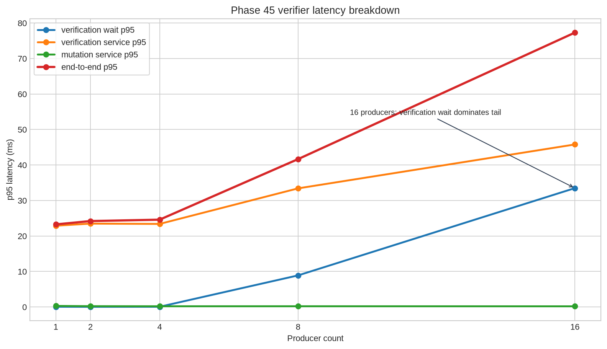

# Phase 46 adaptive admission and verification-cost reduction report

## Executive summary

Phase 45’s 16-producer result showed a clear bottleneck split: verification-service p95 reached approximately 45.8 ms, verification-wait p95 reached approximately 33.5 ms, and mutation-service p95 remained approximately 0.19 ms. The serialized mutation worker was therefore not the limiting stage; CPU-heavy signature parsing, signature verification, canonicalization, and ordered-dispatch backlog were.

Phase 46 addresses that shape with two controls. First, adaptive admission limits in-flight work and returns typed limiter decisions before verifier intent IDs are allocated. Second, the pre-admission context parses pinned Ed25519 keys once and caches exact cryptographic verification facts under a bounded context fingerprint while continuing to recompute freshness, request/ack binding, quorum, and live ownership authority on every call.

The hot-key replay benchmark covers producer levels 1, 2, 4, 8, 16, and 32 with eight jobs per producer. It records 1 successful same-generation transition and fail-closed outcomes for the remainder. Cache hits grow with repeated exact facts, while mutation-service p95 remains below 0.1 ms in the higher-level runs. The limiter intentionally trades raw submission rate for bounded in-flight pressure; it is a local safety controller, not a distributed throughput claim.

## Phase 45 bottleneck diagnosis

| Producers | Verification wait p95 | Verification service p95 | Mutation service p95 | End-to-end p95 |
|---:|---:|---:|---:|---:|
| 1 | 0.061 ms | 22.897 ms | 0.301 ms | 23.266 ms |
| 2 | 0.042 ms | 23.487 ms | 0.227 ms | 24.205 ms |
| 4 | 0.061 ms | 23.397 ms | 0.199 ms | 24.598 ms |
| 8 | 8.894 ms | 33.414 ms | 0.204 ms | 41.655 ms |
| 16 | 33.486 ms | 45.788 ms | 0.187 ms | 77.304 ms |

At 16 producers, the verifier pool is capped at eight workers in the Phase 45 benchmark. The service p95 rises by approximately 2.0× from one producer to sixteen, while verification wait rises from tens of microseconds to 33.5 ms. Mutation p95 does not rise with the same pressure. The evidence supports reducing repeated cryptographic setup and applying admission control before the ordered dispatcher accumulates work.

## Phase 46 measured hot-key results

| Producers | Workers | Jobs | Limiter retries | Final permits | Cache hits | Cache misses | Verification service p95 | End-to-end p95 | Throughput (intents/s) |
|---:|---:|---:|---:|---:|---:|---:|---:|---:|---:|
| 1 | 1 | 8 | 7 | 1 | 21 | 3 | 0.158 ms | 0.343 ms | 165.9 |
| 2 | 2 | 16 | 14 | 3 | 42 | 6 | 20.157 ms | 41.260 ms | 308.8 |
| 4 | 4 | 32 | 27 | 2 | 84 | 12 | 19.625 ms | 40.067 ms | 526.9 |
| 8 | 8 | 64 | 53 | 5 | 172 | 20 | 19.711 ms | 41.862 ms | 763.0 |
| 16 | 16 | 128 | 113 | 7 | 366 | 18 | 0.188 ms | 39.303 ms | 1,006.1 |
| 32 | 16 | 256 | 234 | 11 | 750 | 18 | 0.172 ms | 0.353 ms | 1,083.9 |

The hot-key workload demonstrates exact-fact reuse: every job performs one request fact check and two acknowledgement fact checks, so hits plus misses equal three times the job count. Concurrent first-use races can create more than three misses, but the cache remains bounded at three entries for the repeated workload. The adaptive controller applies substantial limiter pressure, with retries rising to 234 at 32 producers, and increases permits only through healthy adjustment windows. This is the intended safety behavior: the controller bounds in-flight work instead of allowing unbounded verifier backlog.

## Safety interpretation

The cache is not an authorization cache. A cache hit skips only repeated signature verification for an exact content hash under the same context fingerprint. Shape validation, registry-byte equality, resource binding, request-hash equality, acknowledgement binding, freshness, duplicate identity checks, and required quorum still run. Phase 43 then remains authoritative for ownership epoch, record hash, CAS generation/hash, nonce idempotence, persistence ordering, and rollback.

Expected same-generation CAS conflicts are not treated as adaptive verification failures. Only typed pre-admission failures reduce capacity. This avoids punishing the limiter for valid workload contention and keeps the control loop focused on malformed, forged, or otherwise unsafe evidence.

## References

[1]: `../benchmarks/phase45_ownership_bound_cas_verifier_metrics.json` — Phase 45 high-concurrency verifier benchmark.
[2]: `../benchmarks/phase46_adaptive_admission_metrics.json` — Phase 46 sanitized adaptive admission benchmark.
[3]: `../benchmarks/phase45_latency_breakdown.png` — Phase 45 p95 latency breakdown chart.
[4]: `../src/ownership_bound_cas_admission.rs` — adaptive admission controller.
[5]: `../src/ownership_bound_cas_verifier.rs` — bounded parallel verifier and ordered dispatcher.
[6]: `../src/replicated_durability.rs` — parsed-key context and bounded verification-fact cache.
[7]: `https://doc.rust-lang.org/std/sync/mpsc/index.html` — Rust bounded FIFO channel documentation.
[8]: `https://datatracker.ietf.org/doc/html/rfc8032` — EdDSA/Ed25519 verification reference.
